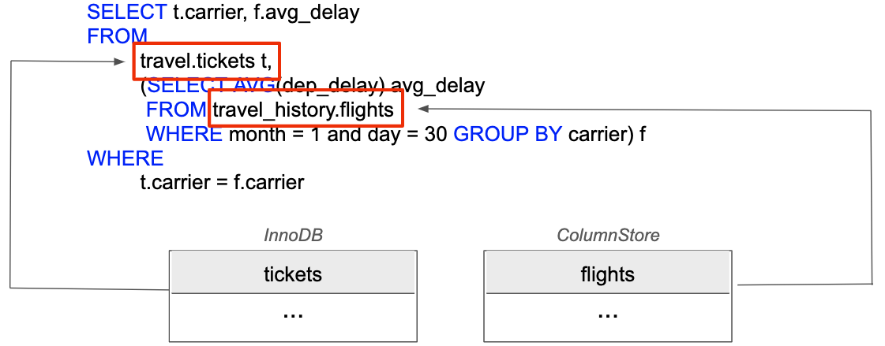

# Bookings

**Bookings** is a web application that, backed by the power of the MariaDB Connectors and the [MariaDB X4 Platform](https://mariadb.com/resources/blog/deploying-mariadb-platform-x4/#smart), unleashes the power of [smart transactions](https://mariadb.com/resources/blog/introducing-mariadb-platform-x4-smart-transactions-and-cloud-native-storage/) on hundreds of millions of records with lightning fast query performance without having to add any indexes!

<p align="center" spacing="10">
    <kbd>
        
    </kbd>
</p>

This README will walk you through the steps for getting the Bookings web application up and running using MariaDB HTAP. To ensure success, please follow the instructions in order.

**Note:** The code provided within this repository is completely open source. Please feel free to use it as you see fit.

# Table of Contents
1. [Requirements](#requirements)
2. [Getting started with MariaDB](#introduction)
3. [Get the code](#code)
4. [Set up the HTAP database instance](#getting-started)
    1. [Get the data, create the schema, and load the data](#data)
    2. [Set up replication](#htap-replication)
    3. [Create app data](#app-data)
5. [Set up the web application](#application)
    1. [Anatomy of the app](#app-anatomy)
    2. [Build and run the app](#build-run)
6. [Additional resources](#resources)
    1. [Smart transactions](#smart-transactions)
    2. [Cross-engine queries](#cross-engine-queries)
7. [Support and Contribution](#support-contribution)
8. [License](#license)

## Requirements <a name="requirements"></a>

This sample application, no matter which API project you target, will requires the following to be installed/enabled on your machine:

* [MariaDB Client](https://mariadb.com/products/skysql/docs/clients/), used to connect to MariaDB instances.
* [Bash](https://www.gnu.org/software/bash/) (if you are using Windows 10, you will need to enable the Windows Subsystem for Linux), used to run the data download script

## Getting started with MariaDB <a name="introduction"></a>

[MariaDB](https://mariadb.com) is a community-developed, commercially supported relational database management system, and the database you'll be using for this application.

If you don't have a MariaDB database up and running you can find more information on how to download, install and start using a MariaDB database in the [MariaDB Quickstart Guide](https://github.com/mariadb-developers/mariadb-getting-started).
## Get the code <a name="code"></a>

Download this code directly or use [git](git-scm.org) (through CLI or a client) to retrieve the code using `git clone`:

```
$ git clone https://github.com/mariadb-corporation/dev-example-bookings.git
```

## Set up the HTAP database instance <a name="getting-started"></a>

In order to run the Bookings application you will need to have a MariaDB instance to connect to. For more information please check out "[Get Started with MariaDB](https://mariadb.com/get-started-with-mariadb/)".

### Get the data, create the schema, and load the data <a name="data"></a>

This application uses (US domestic) flight data freely available from the [Bureau of Transportation on time performance dataset](https://www.transtats.bts.gov/DL_SelectFields.asp?Table_ID=236&DB_Short_Name=On-Time). The [get_flight_data.sh] shell script will be used to download the flight data (between 1990 and 2020) into a folder called _data_. 

Complete the following steps.

1. Download the flight data (approx. 180 million records, ~30 GB). Depending on your internet connection this may take some time. However, you can simply modify [get_flight_data.sh](get_flight_data.sh) script to adjust the amount of flight information that is downloaded. Doing so will not disrupt subsequent steps. 

```bash 
$ ./get_flight_data.sh
```

2. Create the databases and tables load data. Be sure to include your database instance specific information (host url, port number, username, and password)

```bash
$ ./create_and_load.sh host_url port user password
```

**Note:** Remember to wrap argument values in single quotes if they contain special characters (e.g. !)

By default the [create_and_load.sh](create_and_load.sh) script has ssl enabled and assumes a MariaDB [SkySQL certificate authority chain file](https://mariadb.com/products/skysql/docs/operations/connecting/#certificate-authority) exists next to it. Feel free to modify accordingly.

### Set up replication <a name="htap-replication"></a>

Using MariaDB replication, MariaDB Enterprise Server replicates writes from InnoDB tables to the ColumnStore tables, ensuring that the application can perform analytical processing on current data. 

Combining MariaDB replication with MariaDB MaxScale configured as a Binlog Server, MariaDB Enterprise Server can host InnoDB and ColumnStore on the same server.

This application uses replication on a single table called `flights`, which exists `travel.flights` (InnoDB) and `travel_history.flights` (ColumnStore).

#### Direct access

To set up replication on an HTAP instance you have direct access to add the following [replication filter](https://mariadb.com/docs/deploy/htap/#filter-configuration) to the MaxScale configuration file (`/etc/maxscale.cnf`).

```
[replication-filter]
type         = filter
module       = binlogfilter
match        = /[.]flights/
rewrite_src  = innodb
rewrite_dest = columnstore
```

For more information on configuring MariaDB HTAP please review the official [Enterprise Documentation](https://mariadb.com/docs/deploy/htap/#maxscale-configuration).

#### SkySQL

MariaDB SkySQL provides MariaDB Platform for Smart Transactions service, delivering HTAP capabilities. Simply connect to a MariaDB SkySQL (HTAP) instance and execute the following queries.

Create a replication filter.

```sql 
SELECT set_htap_replication('flights','travel','travel_history');
```

Confirm a replication filter has been added.

```sql
SELECT show_htap_replication();
```

For more information on configuring HTAP replication for SkySQL please check out the [official documentation](https://mariadb.com/products/skysql/docs/operations/htap-replication/).

### Create app data <a name="app-data"></a>

This application is merely meant for demonstration purposes so you will need to provide _relevant_ data within the following:

* travel.flights
* travel.tickets
* travel.trips

**Creating searchable flights**

You will need to supply future flights that can be booked. The process for this is to first add a flight and then create a ticket for that flight. Consider the following example.

An upcoming flight (option) from LAX to ORD on May 5th, 2020.

```sql
INSERT INTO `flights` (`year`, `month`, `day`, `day_of_week`, `fl_date`, `carrier`, `tail_num`, `fl_num`, `origin`, `dest`, `crs_dep_time`, `dep_time`, `dep_delay`, `taxi_out`, `wheels_off`, `wheels_on`, `taxi_in`, `crs_arr_time`, `arr_time`, `arr_delay`, `cancelled`, `cancellation_code`, `diverted`, `crs_elapsed_time`, `actual_elapsed_time`, `air_time`, `distance`, `carrier_delay`, `weather_delay`, `nas_delay`, `security_delay`, `late_aircraft_delay`) VALUES (2020, 5, 5, 5, '2020-05-05', 'DL', NULL, 1280, 'LAX', 'ORD', '0600', '0600', NULL, NULL, NULL, NULL, NULL, '0913', '0913', NULL, NULL, NULL, NULL, NULL, NULL, NULL, NULL, NULL, NULL, NULL, NULL, NULL);

INSERT INTO `tickets` (`id`, `fl_date`, `fl_num`, `carrier`, `origin`, `dest`, `price`) VALUES (1, '2020-05-05', 1280, 'DL', 'LAX', 'ORD', 240.00);
```

**Creating upcoming trips**

Currently you need to create upcoming trips manually. To do this you will need to have a flight, ticket, and trip record. Consider the following example.

An upcoming trip from ORD to LAX on July 4th, 2020.

```sql
INSERT INTO `flights` (`year`, `month`, `day`, `day_of_week`, `fl_date`, `carrier`, `tail_num`, `fl_num`, `origin`, `dest`, `crs_dep_time`, `dep_time`, `dep_delay`, `taxi_out`, `wheels_off`, `wheels_on`, `taxi_in`, `crs_arr_time`, `arr_time`, `arr_delay`, `cancelled`, `cancellation_code`, `diverted`, `crs_elapsed_time`, `actual_elapsed_time`, `air_time`, `distance`, `carrier_delay`, `weather_delay`, `nas_delay`, `security_delay`, `late_aircraft_delay`) VALUES (2020, 7, 4, 2, '2020-07-04', 'DL', NULL, 1170, 'ORD', 'LAX', '1420', '1420', NULL, NULL, NULL, NULL, NULL, '1730', '1730', NULL, NULL, NULL, NULL, NULL, NULL, NULL, NULL, NULL, NULL, NULL, NULL, NULL);

INSERT INTO `tickets` (`id`, `fl_date`, `fl_num`, `carrier`, `origin`, `dest`, `price`) VALUES (2, '2020-07-04', 1170, 'DL', 'ORD', 'LAX', 276.00);

INSERT INTO `trips` (`id`, `ticket_id`) VALUES (1, 2);
```

## Set up the web application <a name="application"></a>

### Anatomy of the app <a name="app"></a>

This application is made of two parts:

* Client
    - communicates with the API.
    - is a React.js project located in the [client](client) folder.
* API
    - uses a MariaDB Connector to connect to MariaDB.
    - contains multiple projects, located in the [api](api) folder.
        - [Node.js](api/nodejs)
        - Python (coming soon!)

See the README's in [client](client/README.md) and [api](api/README.md) for more information on how to get started!

### Build and run the app <a name="build-run"></a>

## Additional resources <a name="resources"></a>

### Smart transactions <a name="smart-transactions"></a>

At this point you might be wondering, what are smart transactions?

At their core, smart transactions are the standard transactions that databases have been performing for decades – ultimately powering the online interactions we’ve become accustomed to. The difference with modern applications is the use of real-time analytics before, during and/or after these transactions.

**Pre-transaction**

This application uses real-time analytics before a flight is booked. Each flight ticket option contains information calculated from the historical records (average delay, average duration, flight score, etc.) within the `flights` table.

<p align="center">
    <kbd>
        
    </kbd>
</p>

<p align="center">
    <kbd>
        
    </kbd>
</p>

**Post-transaction**

This application also uses real-time analytics after a flight has been booked, and a trip has been created. 

<p align="center">
    <kbd>
        
    </kbd>
</p>

### Cross-engine queries <a name="cross-engine-queries"></a>

This application uses cross-engine queries to maximize the potentials of the MariaDB X4 Platform. Cross-engine querying is the ability to access, via MaxScale, both the transactional and analytics data within a single query.  

<p align="center">
    <kbd>
        
    </kbd>
</p>

## Support and Contribution <a name="support-contribution"></a>

Please feel free to submit PR's, issues or requests to this project project or projects within the [official MariaDB Corporation GitHub organization](https://github.com/mariadb-corporation).

If you have any other questions, comments, or looking for more information on MariaDB please check out:

* [MariaDB Developer Hub](https://mariadb.com/developers)
* [MariaDB Community Slack](https://r.mariadb.com/join-community-slack)

Or reach out to us diretly via:

* [developers@mariadb.com](mailto:developers@mariadb.com)
* [MariaDB Twitter](https://twitter.com/mariadb)

## License <a name="license"></a>
[](https://opensource.org/licenses/MIT)
